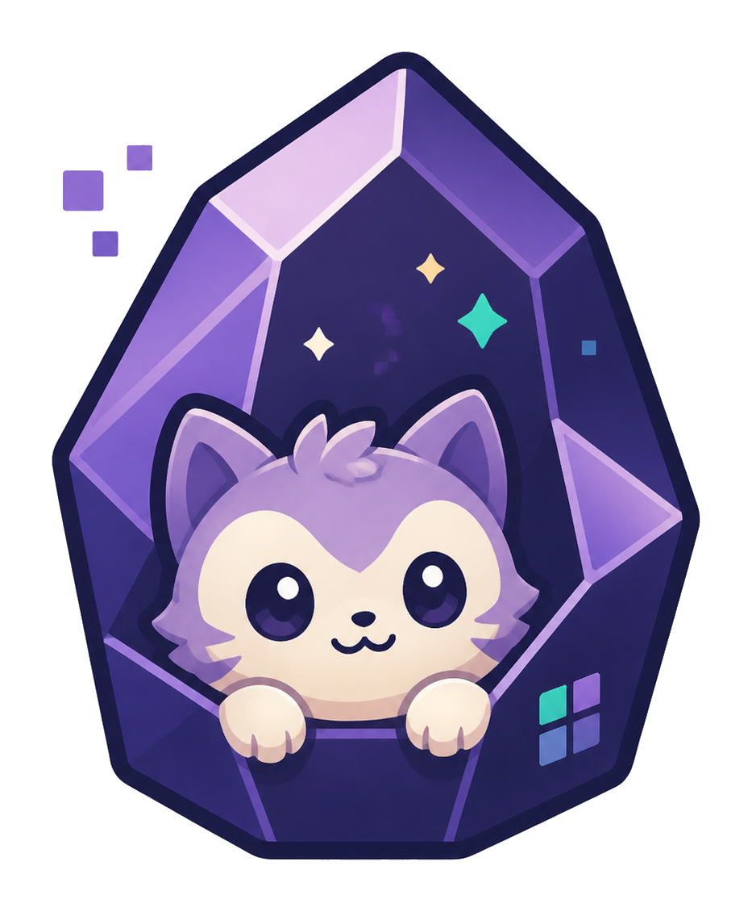

<p align="center">
  
</p>

# Petsidian

[简体中文](README.zh-CN.md)

Petsidian is a desktop-only Obsidian plugin that keeps a detached pet beside your vault. It brings Codex pet imports, actions, bubbles, and desktop behavior into Obsidian's Electron runtime.

GitHub: <https://github.com/X-T-E-R/Petsidian>

## Quick Start

After Petsidian is approved for the Obsidian Community directory, install it from **Settings → Community plugins → Browse**.

To install manually from GitHub Releases:

1. Download `main.js`, `desktop-pet-preload.js`, `manifest.json`, and `styles.css`.
2. Put them in `VaultFolder/.obsidian/plugins/petsidian/`.
3. Reload Obsidian desktop and enable Petsidian.

Petsidian uses Obsidian desktop's Electron / Node APIs and keeps `isDesktopOnly: true`.
It targets Obsidian desktop on Windows, macOS, and Linux, but this repository has not runtime-tested the detached pet window on macOS yet.

## Features

- Transparent detached pet window outside the main Obsidian window.
- Bundled original OpenPet `nia` pet.
- Local import for Codex pet packages, `pet.json`, atlas `.webp`, and static images.
- Web import for Petdex, Codex Pets, and compatible HTTPS pet pages.
- Click actions, random action pool, idle self-play, autonomous walking, drag-to-position, and event bubbles.
- English / Simplified Chinese settings UI.
- Optional plugin API, `obsidian://petsidian` URI handler, and native Obsidian event reactions.

## Import Pets

Local import accepts:

```text
pet.json
spritesheet.webp
```

It also accepts Codex pet package folders, Codex pet atlas `.webp` files, and single `.png`, `.jpg`, `.jpeg`, `.gif`, or `.webp` images. Static images are converted into an `8×9` WebP atlas.

Web import supports:

- [Petdex](https://petdex.crafter.run/): `https://petdex.crafter.run/pets/<slug>`
- [Codex Pets](https://codex-pets.net/): share/detail links
- Compatible public HTTPS pages that expose a pet spritesheet

Website import downloads public metadata and spritesheets for the URL you provide. It does not execute third-party install commands.

## Automation

Stable command IDs:

- `petsidian:toggle-pet`
- `petsidian:show-pet`
- `petsidian:hide-pet`
- `petsidian:open-settings`
- `petsidian:wave`

When enabled in settings, other plugins can call `app.plugins.plugins.petsidian.apiV1`.

When enabled in settings, `obsidian://petsidian?...` accepts only allowlisted actions, events, visibility changes, text, and `ttlMs`.

Native Obsidian event reactions are opt-in and debounced.

## Developer Checks

Default checks:

```powershell
pnpm typecheck
pnpm build
git diff --check
```

Optional runtime checks:

```powershell
pnpm prepare:test-vault
pnpm smoke:obsidian
pnpm smoke:obsidian:attached
```

Use runtime checks when detached-window behavior, import runtime behavior, or release packaging needs a real Obsidian spot check.

## Release

```powershell
pnpm build
```

Before publishing, run through [RELEASE_CHECKLIST.md](./RELEASE_CHECKLIST.md).

Release tags must exactly match `manifest.json.version`, for example `0.1.0` rather than `v0.1.0`. The GitHub Actions workflow uploads `main.js`, `desktop-pet-preload.js`, `manifest.json`, `styles.css`, `versions.json`, and a manual install zip.

## Safety And Rights

- Website import only makes outbound HTTPS requests when you use it.
- Local import only reads files or folders you choose.
- No telemetry.
- No ads.
- No self-update mechanism.
- Imported pets may include third-party artwork or trademarks. Only import pets you have the right to use.
- Petsidian is GPL-3.0-or-later; imported pets may have separate rights requirements.

## Project Links

- GitHub: <https://github.com/X-T-E-R/Petsidian>
- Support / Buy me a milk tea: <https://afdian.com/a/xter123>

## Friendly Links

- [OpenPet](https://github.com/X-T-E-R/OpenPet)
- [linux.do](https://linux.do)
- [Petdex](https://petdex.crafter.run/)
- [Codex Pets](https://codex-pets.net/)

## License And Attribution

Petsidian is released under [GPL-3.0-or-later](./LICENSE).

The bundled `nia` pet and OpenPet-compatible atlas behavior come from [OpenPet](https://github.com/X-T-E-R/OpenPet). Imported third-party pets remain subject to their own licenses.
